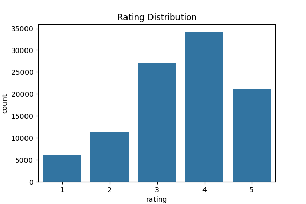
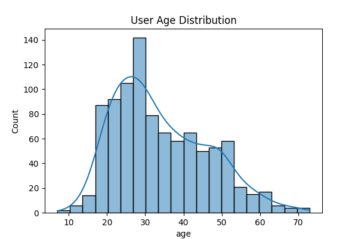

#  Movie Recommendation System (Content-Based + Collaborative Filtering)

This project implements a complete **Movie Recommendation System** using the famous **MovieLens 100k dataset**.  
It includes:
-  **Content-Based Filtering** using genre similarity  
-  **User-Based Collaborative Filtering**  
-  **Exploratory Data Analysis + Visualizations**  
-  **Interactive Gradio App**  
-  Pre-saved matrices for fast loading  
-  HuggingFace Space (Live Demo)

---

##  Live Demo
 **HuggingFace Space:** https://huggingface.co/spaces/NauRaa/Movie_Recommendation_System 


---

##  Badges


---

##  Project Structure

```

 ml-100k/
│── analysis.py              # Data loading, EDA, similarity matrices, functions
│── app.py                   # Gradio interactive dashboard
│── genre_similarity_matrix.pkl
│── user_similarity_matrix.pkl
│── u.data / u.item / u.user / u.genre
│── best_movies_adjusted.csv
│── top_movies_by_count.csv
│── viz_rating_distribution.png
│── viz_age_distribution.png
│── gender_avg_rating.csv
│── README.md                # You're reading it
│── requirements.txt

````

---

##  Features

###  **1. Content-Based Filtering**
Recommends movies based on:
- Genre vectors  
- Cosine similarity  
- Normalized feature matrix  

*Useful for recommending similar movies even for new users.*

---

###  **2. User-Based Collaborative Filtering**
- Builds a **User × Item** rating matrix  
- Computes similarity between users using **Cosine Similarity**  
- Recommends items highly rated by similar users  

*Useful when user history exists.*

---

###  **3. Exploratory Data Analysis**
Included visualizations:
- Rating distribution  
- Top rated movies  
- Highest average ratings  
- Gender rating patterns  
- Age distribution  

---

##  Sample Visualizations

###  Rating Distribution  


###  Age Distribution  


---

##  Gradio App

The interface includes:

-  Dropdown to select a movie (Content-Based)
-  Input box for user ID (Collaborative Filtering)
-  Two tables showing both recommendation types

```python
demo.launch(share=True)
````

---

##  How It Works

###  Load Movie & User Data

###  Build Genre Matrix → Cosine Similarity

###  Create User-Item Matrix → User Similarity

###  Export matrices (for fast inference)

###  Gradio interactive UI connects both pipelines

---

##  Installation

```bash
git clone https://github.com/your-username/ml-100k-recommender.git
cd ml-100k-recommender
pip install -r requirements.txt
```

---

##  Run the Gradio App

```bash
python app.py
```

---

##  Example Output

**Content-Based Recommendations for "Toy Story (1995)"**

| movie_title | release_date | similarity |
| ----------- | ------------ | ---------- |
| ...         | ...          | ...        |

---

##  Requirements

See `requirements.txt`

---

##  Contributions

Pull Requests are welcome!

---

## License

MIT License © 2025 Nauraa 

```
